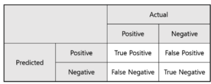
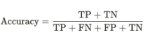
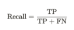
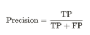
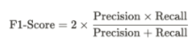
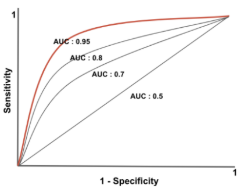
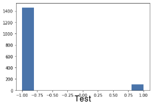

# 반도체 공정의 신호변수를 통한 양품 불량품 분류 및 예측

## 문제정의
복잡한 반도체 제조 공정의 센서 및 공정 측정에서 수집된 신호/변수를 통해 반도체의 양품, 불량품을 분류 및 예측하는 것을 목표로 한다.

이번 문제에서 모든 신호가 특정 모니터링 시스템에서 중요하지 않고 측정된 신호에서 유용한 정보, 관련 없는 정보 및 노이즈 조합이 포함된다. 따라서 유효한 신호를 파악하는 것을 또한 목표로 한다.

## 성능지표
분류예측 문제이므로 혼동행렬을 이용하여 모델을 평가한다. 그리고 해당 문제에 클래스 불균형이 존재하므로 정확도 외에도 재현율, 정밀도, f1 score, AUC score를 평가 성능지표로 이용한다.

 <b> 혼동행렬 </b> 

혼동행렬이란 특정 분류 모델의 성능을 평가하는 지표로, 실제 값과 모델이 예측한 예측 값을 한눈에 알아볼 수 있게 배열한 행렬이다.

이진 분류의 경우 실제 값과 예측 값을 참/거짓에 따라 분류한다. 이진분류의 경우의 혼돈행렬은 아래와 같다.

    

 

본 문제에서 실제 값의 양품/불량품, 예측 값의 양품/불량품에 따라 분류하여 혼돈행렬을 사용한다. 혼동행렬은 TP, TN, FP, FN 네가지 요소로 구성되어 있다.

 <b> 정확도(Accuracy) </b> 

정확도란 모델이 전체 중에서 예측을 올바르게 한 비율이다.

    

 

본 문제에서 정확도는 모델이 전체 중에서 양품을 양품으로 불량품을 불량품으로 예측한 비율이다.

 <b> 재현율(Recall) </b> 

재현율이란 실제 참인 값 중 모델이 참으로 예측한 값의 비율이다.

    

 

본 문제에서 재현율은 실제 불량품인 값 중 모델이 불량품으로 예측한 값의 비율이다.

 <b> 정밀도(Precision) </b> 

정밀도란 모델이 참으로 예측한 값 중 실제로 참인 값의 비율이다.

    

 

본 문제에서 정밀도는 모델이 불량품으로 예측한 값 중 실제로 불량품인 값의 비율이다.

 <b> F1 점수(F1-Score) </b> 

F1 점수란 정밀도와 재현율의 조화평균이다.

    

 

본 문제에서 F1점수는 불량품의 정밀도와 재현율의 조화평균이다.

 <b> AUC 점수(AUC Score) </b> 

AUC점수란 ROC 커브 하단 영역의 넓이를 구한 값으로 0-1사이의 값을 갖는다. 그리고 더 높을수록 더 좋은 분류 성능을 의미한다.

    

 

 <b> 클래스 불균형 문제 </b> 

데이터에서 각 클래스가 갖고 있는 데이터의 양에 차이가 큰 경우, 클래스 불균형이 있다고 한다. 

클래스 균형은 소수의 클래스에 특별히 더 큰 관심이 있는 경우에 필요하다. 클래스가 불균형 할 때 소수의 클래스에 관심이 없다면 다수의 클래스로만 예측을 하여 정확도는 높지만 소수의 클래스를 예측하지 못하는 다수 클래스로의 과적합 문제가 생길 수 있다.

    

 

본 문제에서 클래스 불균형이 존재하고 소수인 불량품의 클래스에 더 관심이 있으므로 평가성능 척도로 불량품의 재현율, 정밀도, f1 점수, auc 점수를 이용한다.

## 탐색적 자료 분석(EDA)
각 변수의 유형, 분포, 결측치 여부, 이상치 여부, 변수 간의 상관관계, 레이블 간의 균형 등의 파악을 통해 데이터를 이해하고 시각화 하여 탐색적 자료 분석을 진행한다.

 <b> 변수유형파악 </b> 

각 변수의 유형을 파악한다.

총 590개의 연속형 신호변수와 1개의 정수형 종속변수, 명목형 날짜변수가 존재한다.
본 문제는 신호 데이터를 이용한 분류예측 문제이므로 명목형 날짜변수는 무의미하다고 판단할 수 있다.

 <b> 변수분포파악 </b> 

종속변수와 날짜변수를 제외한 모든 변수가 연속형 변수이므로 히스토그램을 이용하여 각 변수의 분포를 파악한다.

정규분포, 왼쪽으로 치우친 분포, 오른쪽으로 치우친 분포를 가진 변수가 존재한다. 이는 데이터 변환 단계에서 정규분포로 변환이 필요할 때 이용할 수 있다.
같은 값을 가지는 변수들이 존재한다. 이는 종속 변수에 영향을 주지 않아 무의미하다고 판단할 수 있다.

 <b> 기술 통계량 파악 </b> 

기술 통계량을 통해 중심화 경향, 산포도를 파악한다.

변수 간의 값 차이가 큰 변수가 존재하므로 정확한 분석을 위해 데이터 스케일링이 필요하다고 판단할 수 있다.
데이터의 수(count)를 통해 결측치 여부를 확인할 수 있으며 평균과 중앙값 차이를 통해 이상치 여부를 확인할 수 있고 표준편차가 0인 속성은 분석에 영향을 주지 않는다고 판단할 수 있다.

 <b> 이상치 파악 </b> 

박스 플롯을 통해 각 변수의 분포와 이상치를 파악한다.

각 변수의 박스 플롯에서 1.5IQR을 넘어가는 변수 즉, 이상치를 파악할 수 있다.

 <b> 결측치 파악 </b> 

시각화를 통해 결측치 여부와 결측치 비율을 파악한다. 

 <b> 상관관계 파악 </b> 

상관계수와 산점도를 이용하여 변수 간의 상관관계를 파악한다.

상관계수를 통해 독립 변수 간의 상관관계가 높은 변수조합을 파악해 다중 공선성 문제의 여부를 파악할 수 있다.

산점도를 통해 변수 간의 선형성을 파악할 수 있고 상관계수를 통해 알 수 없는 변수 간의 곡선 선형관계를 파악할 수 있다.

## 기존자료수집
기존자료를 수집하고 기존자료의 데이터 분석과 본 문제를 비교 분석하고 연계하여 본 문제의 모델링 방향을 제시한다.

 <b> 기존연구 문제정의 </b> 

보통 신용기록이 없는 사람들은 안정적인 금융권에서 대출을 받는데 어려움이 많아 사채업을 이용하게 된다. 이러한 문제를 해결하기 위해 신용조사기관에 기록된 고객의 정보를 통해 신용기록이 적거나 전혀 없는 사람들을 대상으로 대출 상환 능력을 분류 및 예측하는 것을 목표로 한 문제이다.
기존연구 자료는 대출 상환 능력의 유무 여부를 종속 변수로 하는 분류 예측 문제임이 명시되어 있다.

 <b> 기존연구 성능평가지표 </b> 

기존의 연구자료에 클래스 불균형 문제가 존재하고 성능평가지표로 ROC와 AUC, F1-score을 사용하였다.

본 연구 또한 클래스 불균형 문제가 존재하며 분류 예측 문제이므로 성능평가지표로 F1-score, AUC score, 정확도, 재현율, 정밀도를 사용한다.

 <b> 기존연구 차원 축소 </b> 

기존의 연구자료에서 차원축소의 방법으로 도메인 지식 특징선택, Embedded 방법을 이용한 특징선택, 앙상블을 이용한 특징선택, PCA를 이용한 차원 축소 등을 사용하였다.

본 연구에서는 독립변수는 신호데이터로 도메인지식을 갖는 특징이 없으므로 제외하고 PCA는 변환된 변수를 직접적인 측정 및 해석이 어렵기 때문에 유효한 변수를 파악해야 하는 본 연구문제에 적합하지 않으므로 제외한다. 따라서 기존 연구자료의 특징선택 방법을 참고한다.

 <b> 기존연구 특징선택 </b> 

기존 연구자료에서 Filter방법(Pearson Correlation, Chi-2), Wrapper방법, Embedded방법(Lasso, RandomForest, LightGBM)을 이용하여 특징중요도를 구한 뒤 상위 100개의 특징을 선택하는 threshold(임계치)를 설정하여 앙상블 방법을 통해 특징선택을 하였다
.
본 연구에서는 범주형 변수가 존재하지 않으므로 Chi-2 필터방법을 제외하고 독립변수의 수가 많으므로 계산시간이 오래 걸리는 Wrapper방법을 제외한다. LightGBM은 학습한 내용인 GBM으로 대체한다. 그리고 특징을 선택하는 임계치를 임의로 정하지 않고 교차검증을 통해 성능이 좋은 특징들을 선택하게 설정한다.

 <b> 기존연구 결측치 대체 </b> 

기존연구자료에서 결측치의 비중이 75% 넘어가는 변수는 제거하고 남은 결측치들은 최빈값으로 단순 대체하였다.
본 연구에서는 결측치의 비중이 90%넘어가는 변수 제거, 나머지 결측치는 해당 변수의 특성을 고려하는 적합한 방법으로 대체한다.

 <b> 기존연구 클래스 불균형문제 </b> 

기존 연구자료에서 클래스 불균형 문제를 해결하기 위해 가중치를 이용하는 방법을 사용하였다.
본 연구 또한 클래스 불균형문제가 존재하므로 기존연구자료를 참고하여 가중치를 이용하는 방법을 고려한다.

 <b> 기존연구 모델선택 </b> 

기존연구자료에서 분석 모델로 Logistic Regression, Random Forest, Light GBM을 선택하였다.

본 연구에서 분류모델로 사용할 수 있는 Logistic Regression, Random Forest, KNN, MLP, SVM 등의 사용을 고려한다.

## 자료 분석
본 연구자료를 분석하고 결과해석 수행 후 문제점을 도출한다.

 <b> 전처리 </b> 

기계학습 방법을 적용하기 위해 우선 데이터를 전처리한다.
5.1.1 무의미한 변수 제거
EDA를 통해 사전에 파악한 무의미한 변수를 제거한다.

본 연구에서 무의미한 날짜데이터를 제거한다. 그리고 종속변수에 영향을 주지 않는 표준편차 값 0을 갖는 독립변수 총 116개를 제거한다.
5.1.2 결측치 대체
EDA를 통해 사전에 파악한 결측치를 대체한다.
결측치 비율이 90%가 넘어가는 변수를 제거하고 10%미만인 변수를 단순 대체하며 그 사이의 변수를 KNN결측 대체를 이용하여 가장 가까운 이웃(n_neighbors=1)의 변수로 최근방 대체한다.
KNNImputer
결측 값을 대치하는데 널리 사용되는 방법으로 결측 값을 갖는 샘플과 다른 샘플과의 거리를 구한 후 가장 가까운 N개 샘플의 관측 값을 이용하여 평균 값을 대체하는 방식이다.

KNNImputer의 장점은 평균, 중앙값, 최빈값을 이용한 단순대체 보다 훨씬 정확하게 대체할 수 있다는 점이다.
5.1.3 특징선택
피어슨 상관계수 필터방법, Lasso, RandomForest, Gradient Boosting 임베디드 방법을 앙상블하여 특징을 선택한다.
피어슨 상관계수(Pearson Correlation)
특징들과 종속 변수의 상관계수를 측정하여 상관계수가 높은 특징 순으로 변수를 추가하며 모델분석(로지스틱)하여 AUC 값을 비교한다. 그리고 높은 AUC 값을 가지는 특징조합을 선택하는 임계치를 설정한다.

해당 과정을 통해 약 110개의 특징이 선택되었다.
라쏘(Lasso)
alpha 값을 조정하며 Lasso를 이용한 모델 분석 후 가장 높은 AUC 값을 가지는 alpha값을 선택한다. 그리고 계수가 0이 아닌 특징을 선택한다.
 
해당 과정을 통해 약 95개의 특징이 선택되었다.
랜덤포레스트(RandomForest)
랜덤포레스트를 이용한 특징 중요도를 측정한 후 중요도가 높은 특징 순으로 변수를 추가하며 모델분석(로지스틱)하여 AUC값을 비교한다. 그리고 높은 AUC 값을 가지는 특징 조합을 선택하는 임계치를 설정한다.

해당 과정을 통해 약 265개의 특징이 선택되었다.
그래디언트부스팅(Gradient Boosting)
그래디언트부스팅을 이용한 특징 중요도를 측정한 후 중요도가 높은 특징 순으로 변수를 추가하며 모델분석(로지스틱)하여 AUC값을 비교한다. 그리고 높은 AUC값을 가지는 특징 조합을 선택하는 임계치를 설정한다.

해당 과정을 통해 약 50개의 특징이 선택되었다.
앙상블(Ensemble)
앞선 특징선택방법에서 선택된 특징들은 True, 선택되지 못한 특징들은 False로 변환하여 앙상블 방법을 이용하여 각 특징선택방법에 3개 이상 포함되는 특징들을 선택한다.

해당 과정을 통해 49개의 변수가 선택되었다.
5.1.4 PCA
EDA를 통해 독립변수 간 상관관계가 높은 변수의 존재를 파악하였으므로 다중공선성의 문제가 있음을 알 수 있다. 이를 해결하기 위해 표준화 및 PCA를 진행한다.
PCA는 차원축소의 역할도 있으므로 기존 변수의 특성을 약 99% 설명하는 pca 변수 42개를 이용하여 분석을 진행한다.
5.1.5 클래스 불균형
EDA를 통해 클래스 불균형이 있음을 파악하였고 이를 해결하기 위해 기존자료를 참고하여 가중치를 이용해 클래스 불균형을 해결한다.

클래스의 비율이 약 14:1이므로 가중치를 1:14로 설정하였다. KNN모델은 거리를 가중치로 하여 가까운 노드에 가중치를 더 많이 주게 설정하였다.

 <b> 모델 선택 및 훈련 </b> 

Training data, Testing data를 8:2의 비율로 나누어 모델 분석을 진행한다.
5.2.1 모델 선택
Logistic Regression, Random Forest, XGB, KNN, Decision Tree, SVM 총 6개의 모델을 선택하였다.
5.2.2 모델 학습
선택된 모델을 이용하여 학습시킨 후 평가성능지표를 이용하여 평가한다.

본 연구에서 불량품을 불량품으로 분류 즉, 1을 1로 분류하는 부분이 중요한데 1의 재현율과 정밀도가 높지 않았다. 그리고 정확도는 높지만 auc값이 낮고 모든 예측을 불량품 즉, -1로 분류하는 클래스 불균형 문제를 해결하지 못한 모델도 존재하였다. 이를 통해 전처리, 클래스 불균형, 모델의 과적합 등이 적합하게 진행되지 않아 전체적으로 모델의 성능이 좋지 않음을 알 수 있었다.
문제점
1. 결측치 대체 시 변수 제거와 대체 기준을 임의로 지정함
2. Random Forest와 Gradient Boosting을 이용하여 특징중요도를 측정할 때 중요도가 일정하지 않아 선택되는 특징이 매번 변함
3. 특징선택시 모델 분석하여 AUC값을 비교할 때 클래스 불균형과 과적합을 고려하지 않음
4. 클래스 불균형 문제가 해결되지 않음
5. 하이퍼파라미터 조정 및 KFold를 이용한 모델의 세부 튜닝을 진행하지 않아 트레인 셋에 과적합 되는 문제를 해결하지 못함

## 개선방안
명확하고 구체적인 개선방안을 세우고 결과에 반영한다.

 <b> 결측치 대체 개선방안 </b> 

결측치 대체 시 변수 제거 비율과 대체 방법을 임의로 정한 문제가 있었다. 이를 개선하기 위해 변수 제거 결측치 비율과 KNN 이웃 수를 비교 분석하여 가장 좋은 조합을 탐색하는 것을 개선방안으로 한다.

비교 분석 결과 결측치 비율 61%이상 특징 제거 61%미만 knn(이웃 수 3)대체 조합이 성능이 가장 좋았다. 따라서 결측치 비율 80%이상의 특징 제거, 10%미만의 특징 단순대체, 사이의 특징 knn(이웃 수 1)대체를 하는 결측치 대체에서 결측치 비율 약 61%이상의 특징제거 61%미만의 특징 knn(이웃 수 3)대체로 개선하였다.

 <b> 특징선택(피어슨 상관계수) 개선방안 </b> 

피어슨 상관계수를 이용한 특징선택에서 특징을 선택하는 임계치 설정 기준이 명확하지 않다는 문제점이 존재하였다. 이를 개선하기 위해 교차검증을 통한 과적합방지, 가중치를 이용한 클래스 불균형문제 해결을 고려하여 임계치 설정 기준을 명확하게 하는 것을 개선방안으로 한다.

개선방안을 통해 Test 셋의 auc값이 확연하게 떨어지는 기준으로 임계치를 설정하였다. 선택된 변수는 개선 전의 110개에서 103개로 개선되었다.

 <b> 특징선택(랜덤포레스트) 개선방안 </b> 

랜덤포레스트 특징중요도를 구할 때, 특징 중요도가 매번 다르게 나와 선택되는 특징이 매번 변하고 특징조합을 선택하는 임계치 설정 기준이 명확하지 않다는 문제점이 존재하였다. 이를 개선하기 위해 Random_state 값을 지정하여 특징 중요도를 일정하게 하고 앞선 방법과 같이 교차검증을 통한 과적합, 가중치를 이용한 클래스 불균형을 고려하여 임계치 설정 기준을 명확하게 하는 것을 개선방안으로 한다.

개선방안을 통해 특징중요도가 고정되어 선택되는 특징변수가 일정해졌고, Test셋의 auc값이 확연하게 떨어지는 기준으로 임계치를 설정하였다. 선택된 변수는 개선 전 약 265개에서 약100개로 개선되었다.

 <b> 특징선택(그래디언트 부스팅) 개선방안 </b> 

그래디언트 부스팅 특징중요도를 구할 때, 분류(Classifier)모델이 아닌 회귀(Regressor)모델을 사용한 오류가 있었고 앞선 랜덤포레스트와 같이 특징중요도가 매번 다르게 나오는 문제, 임계치 설정기준이 명확하지 않은 문제점이 존재하였다. 이를 개선하기 위해 분류(Classifier)모델로 변경하고 앞선 방법과 같이 Random_state 값 지정을 통한 선택되는 특징 고정, 과적합, 클래스 불균형을 고려한 임계치 설정 기준을 명확하게 하는 것을 개선방안으로 한다.

개선방안을 통해 선택되는 특징변수가 일정 해졌고, Test셋의 auc값이 확연하게 떨어지는 기준으로 임계치를 설정하였다. 선택된 변수는 개선 전 약 50개에서 95개로 개선되었다.

 <b> 선택된 특징 분석 </b> 

앞선 특징선택방법의 개선을 통해 각 특징선택방법을 앙상블하여 3개이상 포함되는 특징변수를 선택한다.
6.5.1 필터방법 단점

필터 방법은 위의 그림과 같이 다차원 변수 특성을 파악할 수 없다는 단점이 존재한다. 따라서 필터방법을 이용한 특징선택은 다차원에서 중요한 특징을 가지는 변수를 제거할 수 있다는 단점이 존재한다. 

위의 박스 부분을 보시면 필터방법에 선택되지 않지만 다른 임베디드 방법에 모두 포함되는 특징변수가 존재한다. 이러한 각 특징선택 방법에서 중요한 특징이 제외될 수 있는 경우를 보완하기 위해 앙상블을 이용한 특징선택을 진행하였다.
6.5.2 박스플롯을 이용한 분포 비교

박스플롯을 이용하여 분포를 비교하였을 때, 대부분 분포차이가 존재하며 signal 563, 438, 100, 101 등이 분포차이가 거의 없었다.
6.5.3 히스토그램을 이용한 분포비교

히스토그램분포를 이용하여 비교하였을 때, 대부분 분포차이가 존재하며 signal 461, 576, 469, 317, 116, 100, 101 등이 분포차이가 거의 없었다
박스플롯에서 분포차이가 거의 없지만 히스토그램분포에서 분포차이를 보이는 변수도 존재하였고 반대의 경우도 존재하였다.
6.5.4 산점도를 이용한 분포비교

다음은 Signal 461과 다른 신호변수의 산점도 그래프이다. 대체적으로 분포차이가 나타나며 앞선 박스플롯과 히스토그램 분포에서 분포차이를 보이지 않았던 signal 461, 116, 101 등의 변수 또한 산점도에서 분포차이가 존재함을 알 수 있다. 따라서 다차원에서 분포차이가 존재할 수 있으므로 앞선 박스플롯과 히스토그램 분포만으로 변수가 중요하지 않다고 판단할 수 없음을 알 수 있었으며 이러한 변수들도 특징선택에 반영하기 위해 앙상블을 이용한 특징선택을 진행하였다. 개선방안을 통해 선택된 특징 총 49개에서 41개로 개선되었다.

 <b> PCA </b> 

본 문제에서 결과 해석이 필요하지 않으므로 다중공선성 방지를 위한 PCA는 제외하는 것을 개선방안으로 한다.

 <b> 클래스 불균형 </b> 

기존 분석에서 가중치를 이용한 클래스 불균형 문제해결을 시도하였을 때, 모든 예측을 다수클래스로 하는 클래스 불균형 문제가 여전히 존재하였다. 이를 개선하기 위해 오버샘플링 방법(ADASYN)을 이용하는 것을 개선방안으로 한다.
 ADASYN

ADASYN 방법은 소수 클래스 관측치에 다수 클래스 관측치의 비율을 고려하여 스모트 방식을 이용해 오버샘플링 하는 방식으로 소수클래스 주변의 다수클래스 수에 따라 유동적으로 오버샘플링 할 데이터 개수를 생성한다는 장점이 있다. 본 분석문제에 적합한 오버샘플링방법이라 생각하여 적용하였다.

 <b> 모델선택 </b> 

선택된 모델 6가지(로지스틱, 랜덤포레스트, XGB, KNN, 결정트리, SVM) 중 4가지 모델(로지스틱, 결정트리, 랜덤포레스트, AdaBoost)을 선택하는 것을 개선방안으로 한다.

 <b> 모델분석 </b> 

기존 분석에 트레인셋에 과적합이 되어 성능이 좋지 않은 문제점이 존재하였다. 이를 개선하기 위해 랜덤서치를 통한 하이퍼파라미터 조정 및 KFold를 이용한 모델의 세부 튜닝을 진행하는 것을 개선방안으로 한다.
6.9.1 Kfold 교차검증
모델의 평균적인 성능을 측정 및 비교하기 위해 데이터 셋을 총 10개로 분할하여 10fold 교차검증을 진행한다.

본 문제의 데이터 셋에는 클래스 불균형이 존재하며 소수 클래스의 수가 104개로 10fold 교차검증을 shuffle 없이 진행 시 위와 같이 소수클래스가 거의 없는 셋이 발생할 수 있다. 

위와 같이 shuffle과 random_state 값을 지정하여 소수클래스가 고르게 분포하여 셋이 10개로 나눠지도록 설정하였다.
6.9.2 하이퍼파라미터 튜닝
트레인셋으로의 과적합을 방지하기 위해 총 네가지 모델에 랜덤서치를 이용한 하이퍼파라미터 튜닝을 진행한다.

위와 같은 하이퍼파라미터가 탐색되었다.
랜덤서치(RandomizedSearchCV)

랜덤서치는 하이퍼파라미터 값을 랜덤하게 넣어보고 정해진 간격사이에 위치한 값들에 대해 확률적으로 탐색하여 우수한 값을 보인 하이퍼파라미터를 활용해 모델을 생성하는 것이다. 그리드서치는 지정한 모든 값을 다 탐색해야 하는 반면 랜덤서치는 그런 불필요한 탐색 횟수를 줄일 수 있다는 장점이 있다. 본 문제에서 넓은 범위의 하이퍼파라미터를 빠르고 효과적이게 탐색하기 위해 랜덤서치를 진행하였다.
6.9.3 모델학습
앞서 진행한 10fold와 하이퍼파라미터를 이용하여 총 4가지 모델학습을 진행한다.

4가지 모델 중 랜덤포레스트 모델이 정확도 0.855, auc값 0.681, f1점수 0.305로 성능이 가장 좋음을 알 수 있었다.

 <b> 결론 </b> 

프로젝트를 통해 총 41개의 유의미한 신호를 선택하였으며 반도체의 불량품, 양품을 분류 및 예측하는데 랜덤포레스트 모델이 가장 성능이 좋음을 알 수 있었다.

## 이슈 및 한계점
본 문제는 두가지 이슈가 존재한다. 

첫 번째 이슈는 양품과 불량품을 잘 분류, 예측하는 것이고 두번째 이슈는 분류 및 예측에 유용한 신호변수를 파악하고 선택하는 것이다. 첫 번째 이슈를 충족시키기 위해서는 중요도가 낮은 변수여도 많은 변수를 포함시키는 것이 분류예측의 정확성 및 정밀도 등의 평가성능을 높일 수 있을 것이다. 

두 번째 이슈를 충족시키기 위해서는 성능이 떨어지더라도 많은 신호 변수 중 결과에 영향을 미치는 중요한 변수를 찾는 것에 집중해야 할 것이다. 본 문제는 두가지 이슈를 동시에 충족시키는 것이 어렵다는 한계점이 존재한다. 
